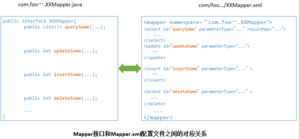
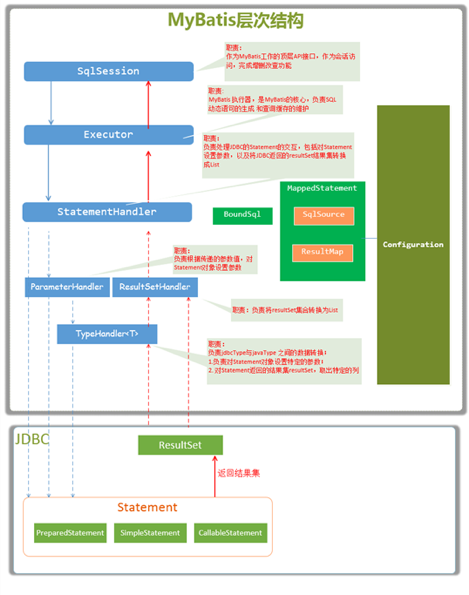

## 义码当仙之MyBatis  

### 接口层和数据库交互的方式  
MyBatis和数据库的交互有两种方式：  
1. 使用传统的MyBatis提供的API  
2. 使用Mapper接口  

### 使用Mapper接口
MyBatis将配置文件中的每一个<mapper>节点抽象为一个Mapper接口：  
这个接口中声明的方法和<mapper>节点中的<select|update|delete|insert>节点项对应，即<select|update|delete|insert>节点的id值为Mapper接口中的方法名称，
parameterType 值表示Mapper对应方法的入参类型，而resultMap值则对应了Mapper接口表示的返回值类型或者返回结果集的元素类型。  

  

根据MyBatis的配置规范配置好后，通过SqlSession.getMapper(XXXMapper.class)方法，MyBatis会根据相应的接口声明的方法信息，通过动态代理机制生成一个Mapper实例，
我们使用Mapper接口的某一个方法时，MyBatis会根据这个方法的方法名和参数类型，确定Statement Id，底层还是通过SqlSession.select("statementId",parameterObject);
或者SqlSession.update("statementId",parameterObject); 等等来实现对数据库的操作，MyBatis引用Mapper 接口这种调用方式，纯粹是为了满足面向接口编程的需要。
（其实还有一个原因是在于，面向接口的编程，使得用户在接口上可以使用注解来配置SQL语句，这样就可以脱离XML配置文件，实现“0配置”）  

### 数据处理层  
数据处理层可以说是MyBatis的核心，从大的方面上讲，它要完成两个功能：
1. 通过传入参数构建动态SQL语句  
2. SQL语句的执行以及封装查询结果集成List<E>  

### 框架支撑层

#### 事务管理机制  
事务管理机制对于ORM框架而言是不可缺少的一部分，事务管理机制的质量也是考量一个ORM框架是否优秀的一个标准。  

#### 连接池管理机制  
由于创建一个数据库连接所占用的资源比较大，对于数据吞吐量大和访问量非常大的应用而言，连接池的设计就显得非常重要。  

#### 缓存机制  
为了提高数据利用率和减小服务器和数据库的压力，MyBatis 会对于一些查询提供会话级别的数据缓存，会将对某一次查询，
放置到SqlSession 中，在允许的时间间隔内，对于完全相同的查询，MyBatis会直接将缓存结果返回给用户，而不用再到数据库中查找。  

#### SQL语句的配置方式  
传统的MyBatis配置SQL语句方式就是使用XML文件进行配置的，但是这种方式不能很好地支持面向接口编程的理念，为了支持面向接口的编程，MyBatis引入了Mapper接口的概念，面向接口的引入，
对使用注解来配置SQL语句成为可能，用户只需要在接口上添加必要的注解即可，不用再去配置XML文件了，但是，目前的MyBatis只是对注解配置SQL语句提供了有限的支持，某些高级功能还是要依赖XML配置文件配置SQL语句。  

### 引导层
引导层是配置和启动MyBatis配置信息的方式。MyBatis提供两种方式来引导MyBatis：基于XML配置文件的方式和基于Java API的方式。  

### 主要构件及其相互关系
从MyBatis代码实现的角度来看，MyBatis的主要的核心部件有以下几个：  
- SqlSession：作为MyBatis工作的主要顶层API，表示和数据库交互的会话，完成必要数据库增删改查功能；  
- Executor：MyBatis执行器，是MyBatis调度的核心，负责SQL语句的生成和查询缓存的维护；  
- StatementHandler：封装了JDBC Statement操作，负责对JDBC statement的操作，如设置参数、将Statement结果集转换成List集合。  
- ParameterHandler：负责对用户传递的参数转换成JDBC Statement所需要的参数；  
- ResultSetHandler：负责将JDBC返回的ResultSet结果集对象转换成List类型的集合；  
- TypeHandler：负责java数据类型和jdbc数据类型之间的映射和转换；  
- MappedStatement：MappedStatement维护了一条<select|update|delete|insert>节点的封装；  
- SqlSource：负责根据用户传递的parameterObject，动态地生成SQL语句，将信息封装到BoundSql对象中，并返回；  
- BoundSql：表示动态生成的SQL语句以及相应的参数信息；  
- Configuration：MyBatis所有的配置信息都维持在Configuration对象之中；  

  

### 手写MyBatis框架（注解版，基本实现）

> 示例项目：ymdx-mybatis -> mybatis-annotation-customize  

